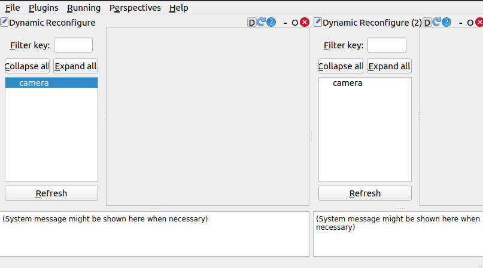
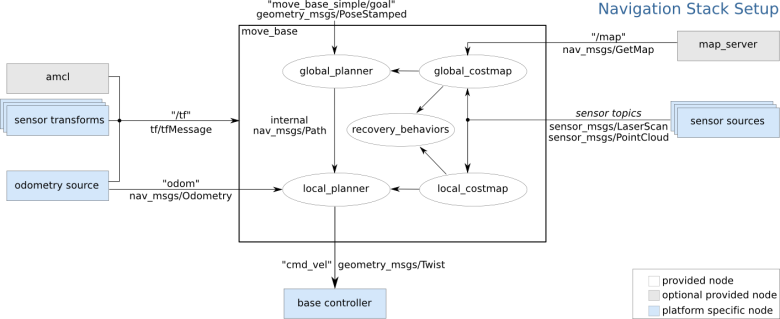

# ROS1demo
referencing [ROS | autolabor](http://www.autolabor.com.cn/book/ROSTutorials/)

## 松耦合


```txt
WorkSpace --- 自定义的工作空间
    |--- build:编译空间，用于存放CMake和catkin的缓存信息、配置信息和其他中间文件。
    |--- devel:开发空间，用于存放编译后生成的目标文件，包括头文件、动态&静态链接库、可执行文件等。
    |--- src: 源码
        |-- package：功能包(ROS基本单元)包含多个节点、库与配置文件，包名所有字母小写，只能由字母、数字与下划线组成
            |-- CMakeLists.txt 配置编译规则，比如源文件、依赖项、目标文件
            |-- package.xml 包信息，比如:包名、版本、作者、依赖项...(以前版本是 manifest.xml)
            |-- scripts 存储python文件
            |-- src 存储C++源文件
            |-- include 头文件
            |-- msg 消息通信格式文件
            |-- srv 服务通信格式文件
            |-- action 动作格式文件
            |-- launch 可一次性运行多个节点 
            |-- config 配置信息
        |-- CMakeLists.txt: 编译的基本配置
```


## 通讯机制

**话题通信**


**服务通信**


**参数服务器**


**action—具有服务特性的话题通信**


**动态参数—具有服务器特性的服务通信**




## 工具命令

- node

```shell
rosnode list
rosnode info
```

- Topic communication: publish and subscribe

```shell
rqt_graph | rostopic list                                      # get <TOPIC_NAME>
rostopic info <TOPIC_NAME>                                     # get <TOPIC_TYPE>
rostopic find <TOPIC_TYPE>									   # get accurate <TOPIC_NAME>
rosmsg info <TOPIC_TYPE>                                       # get accurate <TOPIC_FORMAT>
rostopic echo <TOPIC_NAME>                                     # test1
rostopic pub -r <NUM> <TOPIC_NAME> <Tab x2>                    # test2

rosmsg package <PACKAGE_NAME>								   # get <TOPIC_FORMAT>
```

- Service communication: request and response

```shell
rqt_graph\rostservice list                                     # get <SERVICE_NAME>
rosservice info <SERVICE_NAME>                                 # get <SERVICE_TYPE> 
rosservice find <SERVICE_TYPE>						     	   # get accurate <SERVICE_NAME>
rossrv info <SERVICE_TYPE>                                     # get <SERVICE_FORMAT>
rosservice call <SERVICE_NAME> <Tab>                           # test1

rossrv package <PACKAGE_NAME>								   # get  <SERVICE_FORMAT>
```

- Parameter server: parameter sharing

```shell
rqt_graph | rostparam list                                     # index <PARAM_NAME>
rosparam get <PARAM_NAME>                                      # get <PARAM_VALUE>
rosparam set <PARAM_NAME> <Tab>  ||rosrun || launchFile        # set <PARAM_NAME>
```

- tf：坐标转换关系可视化

```shell
rosrun tf2_tools view_frames.py
```

- urdf/xacro：机器人仿真文件生成与检查

```shell
rosrun xacro xacro xxx.xacro > xxx.urdf
check_urdf xxx.urdf
urdf_to_graphiz xxx.urdf
```

- rosbag：ros仿真记录

```shell
rosbag record -a -O <file> 
rosbag info <file>
rosbag play <file>
```

- plugin_nodelet

```xml
<launch>
    <node pkg="nodelet" type="nodelet" name="Manager" args="manager" output="screen" />
    <node pkg="nodelet" type="nodelet" name="node1" args="load plugin_nodelet/nodelet Manager" output="screen" >
        <param name="value" value="100" />
    </node>
    <node pkg="nodelet" type="nodelet" name="node2" args="load plugin_nodelet/nodelet Manager" output="screen" >
        <param name="value" value="-50" />
        <remap from="/node2/in" to="/node1/out" />
    </node>
</launch>
```

- rqt：ros命令集成GUI
  - topic|rqt_plot：话题信息发布和监视
  - service：服务请求
  - rqt_graph：节点关系网
  - rqt_console：日志过滤
  - rviz|`rosrun tf2_tools view_frames.py`：tf坐标系
  - rqt_bag：录制重放信息发布
  - dynamic reconfigure：动态参数
- rviz：可视化常用数据与服务


## VScode

> `cd <WORKSPACE_NAME> ` & `code .` 

- .vscode/tasks.json：`ctrl + shift + B` —>`catkin_make`


```json
{
	"version": "2.0.0",
	"tasks": [
		{
			"label": "catkin_make:debug", 
			"type": "shell",
			"command": "catkin_make",
			"args": [],
			"group": {"kind":"build","isDefault":true},
			"presentation": {
				"reveal": "always"
			},
			"problemMatcher": "$msCompile"
		}
	]
}
```

- .vscode/c_cpp_properties.json：`code hints ` —> `includePath`/`c++17`

```json
{
  "configurations": [
    {
      "browse": {
        "databaseFilename": "${default}",
        "limitSymbolsToIncludedHeaders": false
      },
      "includePath": [        
        "/opt/ros/noetic/include/**",
        "/usr/include/**",
        "../<WORKSPACE_NAME>/src/<PACKAGE_NAME>/include/**",
        "../<WORKSPACE_NAME>/devel/include/**", 
      ],
      "name": "ROS",
      "intelliSenseMode": "gcc-x64",
      "compilerPath": "/usr/bin/gcc",
      "cStandard": "gnu11",
      "cppStandard": "c++17"      
    }
  ],
  "version": 4
}
```

- .vscode/settings.json：`code hints ` —> `python.autoComplete.extraPaths`

```json
"python.autoComplete.extraPaths": [
    "/opt/ros/noetic/lib/python3/dist-packages",
    "../<WORKSPACE_NAME>/devel/lib/python3/dist-packages"
]
```


## 命名空间

> 重名问题：`/`全局—>`topicnamespace`相对—>`nodename`私有

- package(no solution)

- node(no samenode)


```
//rosrun
rosrun <package> <exe_name> __ns:=/<namespace>
rosrun <package> <exe_name> __name:=<othername>

//.launch
<node name="<othername>" ns="<namespace>"/>

//code
ros::init(map,...,ros::init_options::AnonymousName)
rospy.init_node(...,anonymous=True)

//通过argv修改参数
```

- topic(Chaotic communication)


```
//rosrun
rosrun <package> <exe_name> /oldtopic:=/newtopic

//.launch
<remap from="oldtopic" to="newtopic" />

//code
nh.advertise<>("/全局话题");
nh.advertise<>("相对话题");
ros::Nodehandle nh("私有空间");nh.advertise<>("私有话题");/rospy.Publisher("~私有话题")

//通过argv修改参数
```

- param(cover)

```
//rosrun(默认nodename私有空间命名)
rosrun <package><exe_name> _<paramname>:=<paramvalue>

//.launch
<rosparam  ns="<namespace(全局命名)>" />
<param (私有命名)/>

//code
ros::param::set("/全局参数");
ros::param::set("相对参数");
ros::param::set("~私有参数");

//通过argv修改参数
```


## 分布式

> roscore主机、rosrun从机

- 不同计算机处于同一网络中，虚拟机网络桥接模式

- 设置固定IP—可直接通过`wired setting`

- ` /etc/hosts`定位分布式DNS` ping`  [ `ifconfig`  `hostname`]

- `~/.bashrc`分布式定位主机IP

  ```shell
  export ROS_MASTER_URI=http://主机IP:11311
  export ROS_HOSTNAME=本机IP
  ```

- `source ~/.bashrc`

- 主机启动`roscore`，分布式`rosrun`


## 自定义

> `sudo ln -s /usr/bin/python3 /usr/bin/python`

1. 创建工作空间并初始化

   ```shell
   mkdir -p <WORKSPACE_NAME>/src
   cd <WORKSPACE_NAME>
   catkin_make
   ```

2. 创建功能包并添加依赖`package.xml`

   ```shell
   cd src
   catkin_create_pkg <PACKAGE_NAME> roscpp rospy stdmsgs ...
   ```

   ```xml
   <!-- 编译时功能包依赖 -->
   <build_depend><DEPEDENCE></build_depend>
   <!-- 运行时功能包依赖 -->
   <exec_depend><DEPEDENCE></exec_depend>
       
   <!-- 功能 -->
   <export>
       1.<metapackage />
       	- CMakeLists.txt
       		- cmake_minimum_required(VERSION 3.0.2)
   			- project(demo)
   			- find_package(catkin REQUIRED)
   			- catkin_metapackage()
       2.<<BASE_PACKAGE_NAME> plugin="${prefix}/<plugin>.xml" />
           - rospack plugins --attrib=plugin <<BASE_PACKAGE_NAME>
   </export>
   ```

3. 编辑源文件`src` \ `scripts`  通信文件`msg` \ `srv` \ `action` \ `cfg` 头文件 `include/<PACKAGE_NAME>`

   ```shell
   cd  <PACKAGE_NAME>
   vim src/<EXE_FILE_NAME>.cpp
   vim scripts/<EXE_FILE_NAME>.py
   vim msg/<MESSAGE>.msg
   vim srv/<service>.srv
   ```

4. 编辑配置`Cmakelist.txt`

   ```cmake
   #  编译时功能包依赖
   find_package(catkin REQUIRED COMPONENTS
     roscpp
     rospy
     std_msgs
     <PACKAGE_NAME>
   )
   # 运行时功能包依赖
   catkin_package(
   #  INCLUDE_DIRS include
   #  LIBRARIES demo01_hello_vscode
     CATKIN_DEPENDS roscpp rospy std_msgs message_runtime
   #  DEPENDS system_lib
   )
   
   # msg源文件配置
   add_message_files(
     FILES
     <MESSAGE>.msg
   )
   # srv源文件配置
   add_service_files(
     FILES
     <SERVICE>.srv
   )
   # 消息文件生成依赖配置
   generate_messages(
     DEPENDENCIES
     std_msgs
   )
   
   # 头文件配置
   include_directories(
   include
     ${catkin_INCLUDE_DIRS}
   )
   add_library(<HEAD>
     include/<PACKAGE_NAME><HEAD>.h
     src/<HEAD>.cpp
   )
   
   # cpp执行配置
   add_executable(<EXE_FILE_NAME>
     src/<EXE_FILE_NAME>.cpp
   )
   
   # cpp编译配置
   add_dependencies(<HEAD> ${PROJECT_NAME}_generate_messages_cpp)
   add_dependencies(<EXE_FILE_NAME> ${PROJECT_NAME}_generate_messages_cpp)
   target_link_libraries(<HEAD>
     ${catkin_LIBRARIES}
   )
   target_link_libraries(<EXE_FILE_NAME>
     <HEAD>
     ${catkin_LIBRARIES}
   )
   
   #py执行配置
   catkin_install_python(PROGRAMS 
     scripts/<EXE_FILE_NAME>.py
     DESTINATION ${CATKIN_PACKAGE_BIN_DESTINATION}
   )
   ```

   cpp：`cd <WORKSPACE_NAME> `&`catkin_make`

   py：`chmod +x *.py`

5. 测试运行

   ```shell
   cd <WORKSPACE_NAME>
   source ./devel/setup.bash
   ```

   ```shell
   roscore
   rosrun <PACKAGE_NAME> <EXE_FILE_NAME>
   ```

   ```shell
   cd  <PACKAGE_NAME>
   touch launch/<LAUNCH_FILE_NAME>.launch
   ```

   ```xml
   <launch deprecated = "声明">
       <rosparam 
       	command="load|dump|delete" 
           file="$(find <package>)/launch/<param>.yaml" 
           param="<name>" 
           ns="<namespace>"      
       />
       <arg name="xxx" value="xxx" default="xxx" doc="<describe>"/>  
       <!---value="$(arg <name>)"--->
       <node 
       	pkg="<package>" 
           type="<exe>" 
           name="<nodename>" 
           args="xxx xxx" 
           output="log|screen" 
           respawn= respawn_delay=" N" 
           required="true|false" 
           ns="<namespace>" 
           machine="<machineposition>" 
           clear_params="true|false"
       />
       	<remap from="oldtopic" to="newtopic" />
       	<param name="xxx" type="xxx" value="xxx" />
       <include 
           file="$(find <package>)/launch/<launch>.launch" 
           ns="<namespace>"
       />
       <group ns="<namespace>" clear_params="true|false">
       </group>
   </launch>
   ```

   ```shell
   roslaunch  <PACKAGE_NAME> <LAUNCH_FILE_NAME>.launch
   ```


## 高层技能

> 仿真：urdf/xacro —> `[gazebo (environment)]` —> `[control(Pub&Sub topic/tf)]`  —> launch rviz

### 导航

$$
In\ transform\ of\ map \leftarrow odom \leftarrow base\_link \or base\_footprint\\
$$

$$
laser \xrightarrow[SLAM]{scan\rightarrow map} mapserver \and odometer \xrightarrow[acml]{scan\and map \and odom\rightarrow pose} action
 \xrightarrow[move\_base]{goal \and costmap \rightarrow plan\_path \rightarrow cmd\_vel} base
$$

$$
camera \xrightarrow[depthimage_to_laserscan]{image\rightarrow scan}mapserver
$$





